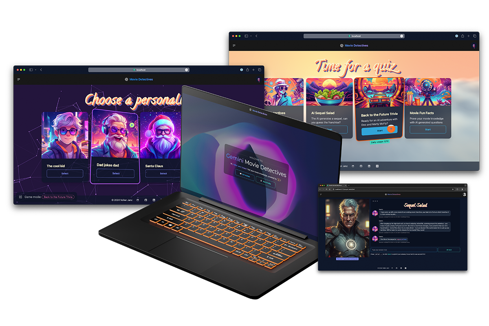
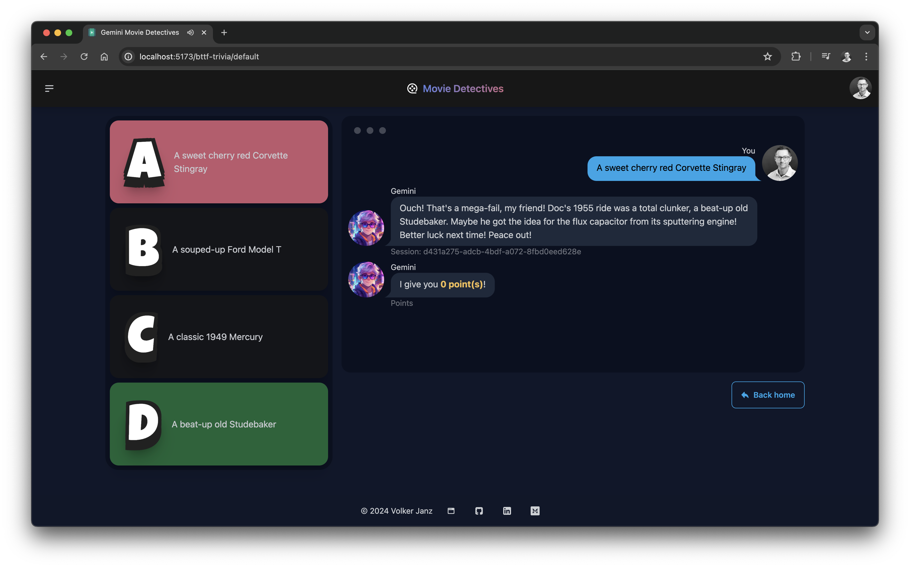
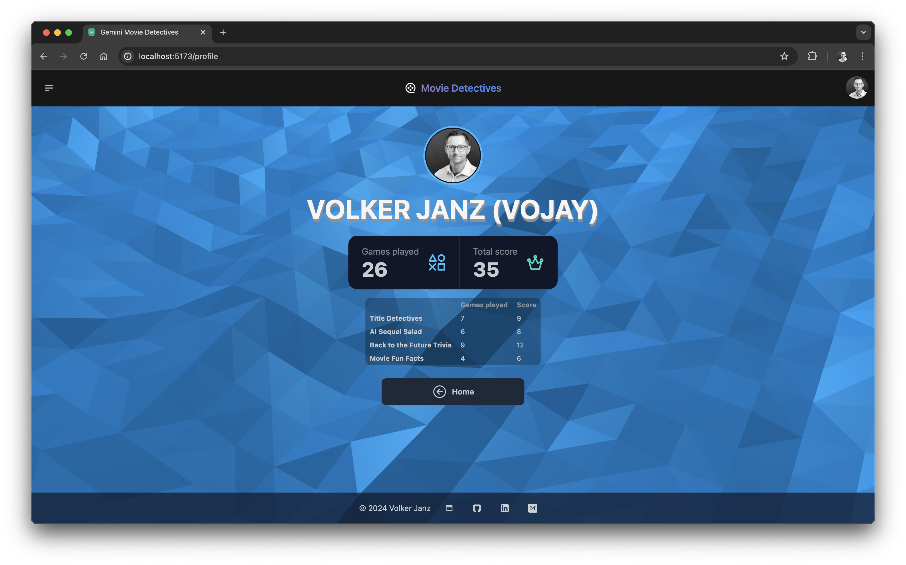
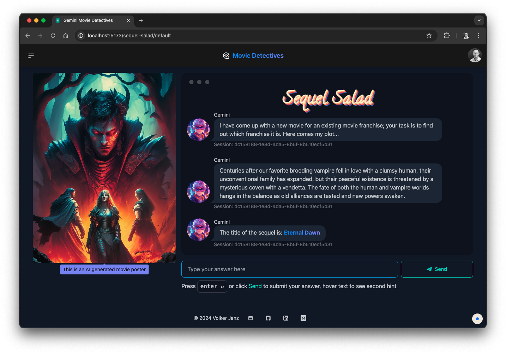
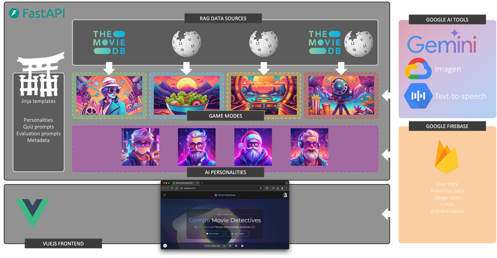
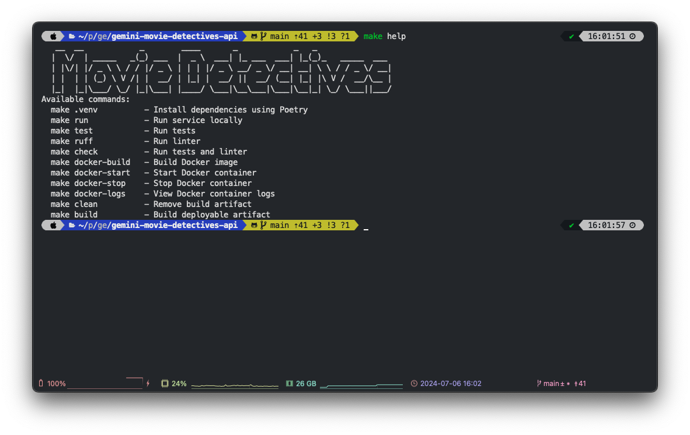
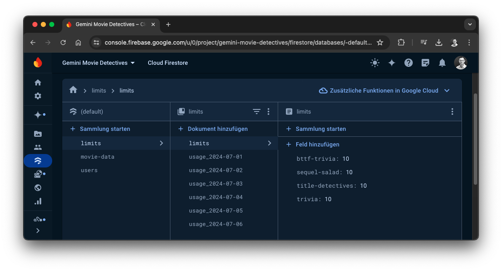
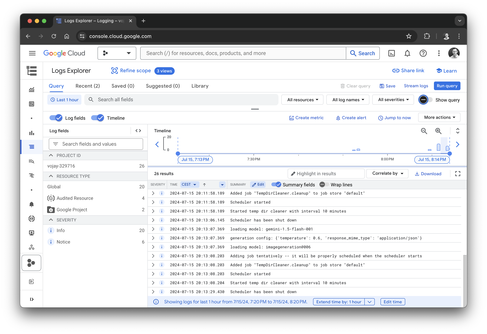
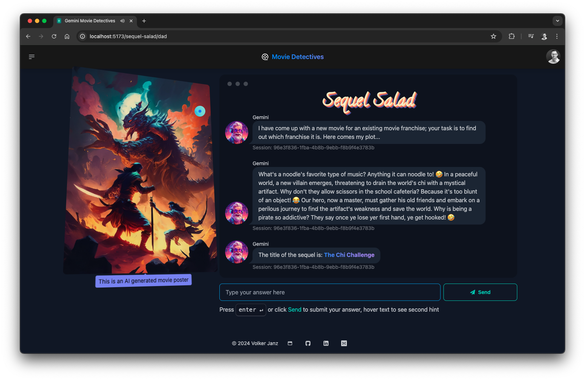

# Gemini Movie Detectives API


Gemini Movie Detectives harnesses Google's AI to revolutionize educational gaming, transforming movie trivia
into a proof-of-concept gateway for AI-driven, adaptive learning across all subjects, challenging your inner
movie nerd while showcasing how AI can reshape education in schools and universities.

**Try it yourself**: [movie-detectives.com](https://movie-detectives.com/)

## Backend

The backend infrastructure is built with FastAPI and Python, employing the Retrieval-Augmented Generation (RAG)
methodology to enrich queries with real-time metadata. Utilizing Jinja templating, the backend modularizes
prompt generation into base, personality, and data enhancement templates, enabling the generation of accurate
and engaging quiz questions in different game modes. Each game mode uses a different combination of data source
showcasing the broad range of possibilities how to employ advanced Gemini applications.

In addition to Gemini, the application leverages Google's state-of-the-art Text-to-Speech AI to synthesize quiz
questions, dramatically enhancing the immersive atmosphere of a professional trivia game show. Moreover, the
Sequel Salad game mode demonstrates the power of AI integration by utilizing Gemini to generate creative prompts.
These prompts are then seamlessly fed into Google's cutting-edge Imagen text-to-image diffusion model, producing
fake movie posters. This sophisticated interplay of various AI models showcases the limitless potential for
creating captivating and dynamic game experiences, pushing the boundaries of what's possible in interactive
entertainment.

The application's infrastructure is further strengthened by the integration of Google Firebase. This integration
enables secure user authentication, facilitating personalized interactions within the app. Firestore is used to
store and manage essential user data, powering the dynamic rendering of user profiles with game statistics.
Additionally, it handles crucial metadata, including movie franchise information and game mode usage metrics
together with configurable limits, allowing for precise control over daily operational costs.

## Frontend

The frontend is powered by Vue 3 and Vite, supported by daisyUI and Tailwind CSS for efficient frontend
development. Together, these tools provide users with a sleek and modern interface for seamless interaction
with the backend.

## Summary

In Movie Detectives, quiz answers are interpreted by the Language Model (LLM) once again, allowing for dynamic
scoring and personalized responses. This showcases the potential of integrating LLM with RAG in game design and
development, paving the way for truly individualized gaming experiences. Furthermore, it demonstrates the
potential for creating engaging quiz trivia or educational games by involving LLM. Adding and changing personalities
is as easy as adding more Jinja template modules. With very little effort, this can change the full game experience,
reducing the effort for developers. Try it yourself and change the AI personality in the quiz configuration.

Movie Detectives tackles the challenge of maintaining student interest, improving knowledge retention, and making
learning enjoyable. It's not just a movie quiz; it’s a glimpse into AI-enhanced education, pushing boundaries
for accessible, engaging, and effective learning experiences.



---

## Examples


*Game mode: Back to the Future Trivia*


*User profile*


*Game mode: Sequel Salad*

---

**Frontend**: [gemini-movie-detectives-ui](https://github.com/vojay-dev/gemini-movie-detectives-ui)

## Tech stack and project overview

- Python 3.12 + [FastAPI](https://fastapi.tiangolo.com/) API development
- [httpx](https://www.python-httpx.org/) for TMDB client implementation
- [Jinja](https://jinja.palletsprojects.com/) templating for modular prompt generation including personalities
- [Pydantic](https://docs.pydantic.dev/latest/) for data modeling and validation
- [Poetry](https://python-poetry.org/) for dependency management
- [Docker](https://www.docker.com/) for deployment
- [Firestore](https://firebase.google.com/docs/firestore) for storing user data, quiz usage and limit management as well as managing the list of franchises for the Sequel Salad game mode
- [Firebase](https://firebase.google.com/) for user authentication
- [TMDB API](https://www.themoviedb.org/) for movie metadata
- [Wikipedia](https://pypi.org/project/wikipedia/) for fetching data from Wikipedia to add more context to the generation process, especially for movie fun facts and Back to the Future trivia
- [Gemini](https://cloud.google.com/vertex-ai/docs/generative-ai/model-reference/gemini) via [VertexAI](https://cloud.google.com/vertex-ai) for generating quiz questions and evaluating answers
- [Imagen](https://imagen.research.google/) via [VertexAI](https://cloud.google.com/vertex-ai) for generating fake movie posters
- [Ruff](https://docs.astral.sh/ruff/) as linter and code formatter together with [pre-commit](https://pre-commit.com/) hooks
- [Github Actions](https://github.com/features/actions) to automatically run tests and linter on every push


*Movie Detectives - System Overview*

## Makefile

The project includes a `Makefile` with common tasks like setting up the virtual environment with Poetry, running the
service locally and within Docker, running test, linter and more. Simply run:
```sh
make help
```
to get an overview of all available tasks.


*make help*

## Project setup

**(Optional) Configure poetry to use in-project virtualenvs**:
```sh
poetry config virtualenvs.in-project true
```

**Install dependencies**:
```sh
poetry install
```

**Run**:

*Please check the Configuration section to ensure all requirements are met.*
```sh
poetry run fastapi dev gemini_movie_detectives_api/main.py
curl -s localhost:8000/movies | jq .
```

## Configuration

**Prerequisite**

- TMDB API key ([can be generated for free](https://developer.themoviedb.org/docs/getting-started))
- GCP project with TTS and VertexAI API enabled and access to Gemini (`gemini-1.5-pro-001`) and Imagen (`imagegeneration@006`)
- Firebase project with authentication and Firestore enabled
- JSON credentials file for GCP Service Account with VertexAI permissions
- JSON credentials file for Firebase Service Account with write permissions

The API is configured via environment variables. If a `.env` file is present in the project root, it will be loaded
automatically. The following variables must be set:

- `TMDB_API_KEY`: The API key for The Movie Database (TMDB).
- `GCP_PROJECT_ID`: The ID of the Google Cloud Platform (GCP) project used for VertexAI and Gemini.
- `GCP_LOCATION`: The location used for prediction processes.
- `GCP_SERVICE_ACCOUNT_FILE`: The path to the service account file used for authentication with GCP.
- `FIREBASE_SERVICE_ACCOUNT_FILE`: The path to the service account file used for authentication with Firebase.

There are more config variables with defaults, which can be used to adjust the default API behavior.

The necessary documents within Firestore are created automatically when the API is started for the first time. The
limits and franchises can be adjusted in the Firestore console.



**Gemini model**

The default model used for Gemini is `gemini-1.5-pro-001`. To use a different model, simply adjust the `GCP_GEMINI_MODEL`
in the `.env` file. For this use-case, also the Flash model delivers good results and might be a cost efficient
alternative.
```
GCP_GEMINI_MODEL=gemini-1.5-flash-001
```

### Logging

The API uses the Python logging module and optionally supports Cloud Logging to allow for log analysis and monitoring
via Google Cloud. To enable Cloud Logging, set the `GCP_CLOUD_LOGGING_ENABLED` environment variable to `true`. Ensure
that the provided Service Account, which belongs to the JSON credentials file set as `GCP_SERVICE_ACCOUNT_FILE`, has
the necessary permissions (e.g. role: _Logs Writer_) to write logs to Cloud Logging.


*Google Cloud Logging*

## Docker

All Docker commands are also encapsulated in the `Makefile` for convenience.

### Build

```sh
docker build -t gemini-movie-detectives-api .
```

### Run

```sh
docker run -d --rm --name gemini-movie-detectives-api -p 9091:9091 gemini-movie-detectives-api
curl -s localhost:9091/movies | jq .
docker stop gemini-movie-detectives-api
```

### Save image for deployment

```sh
docker save gemini-movie-detectives-api:latest | gzip > gemini-movie-detectives-api_latest.tar.gz
```

## Gemini interaction

Gemini interaction is encapsulated in the `GeminiClient` class. To ensure a high quality of prompt responses and to
avoid unnecessary parsing issues. The `GeminiClient` class uses the Gemini JSON format mode.

See: [https://ai.google.dev/gemini-api/docs/api-overview#json](https://ai.google.dev/gemini-api/docs/api-overview#json)

This ensures Gemini replies with valid JSON, whereas the schema is attached to the individual prompt, for example:
```
Reply using this JSON schema:

{"question": str, "hint1": str, "hint2": str}

- question: your generated question
- hint1: The first hint to help the participants
- hint2: The second hint to get the title more easily
```

This approach is then combined with Pydantic models to ensure the correctness of datatypes and the overall structure:
```py
    @staticmethod
    def _parse_gemini_answer(gemini_reply: str) -> TitleDetectivesGeminiAnswer:
        try:
            return TitleDetectivesGeminiAnswer.model_validate(from_json(gemini_reply))
        except Exception as e:
            msg = f'Gemini replied with an unexpected format. Gemini reply: {gemini_reply}, error: {e}'
            logger.warning(msg)
            raise ValueError(msg)
```

This is a great example how to programatically interact with Gemini, ensure the quality of the responses and use a LLM
to cover core business logic.

## API example usage

### Get a list of movies

```sh
curl -s localhost:8000/movies | jq .
```

### Get a random movie

```sh
curl -s localhost:8000/movies/random | jq .
```

```json
{
  "adult": false,
  "backdrop_path": "/oe7mWkvYhK4PLRNAVSvonzyUXNy.jpg",
  "belongs_to_collection": null,
  "budget": 85000000,
  "genres": [
    {
      "id": 28,
      "name": "Action"
    },
    {
      "id": 53,
      "name": "Thriller"
    }
  ],
  "homepage": "https://www.amazon.com/gp/video/detail/B0CH5YQPZQ",
  "id": 359410,
  "imdb_id": "tt3359350",
  "original_language": "en",
  "original_title": "Road House",
  "overview": "Ex-UFC fighter Dalton takes a job as a bouncer at a Florida Keys roadhouse, only to discover that this paradise is not all it seems.",
  "popularity": 1880.547,
  "poster_path": "/bXi6IQiQDHD00JFio5ZSZOeRSBh.jpg",
  "production_companies": [
    {
      "id": 21,
      "logo_path": "/usUnaYV6hQnlVAXP6r4HwrlLFPG.png",
      "name": "Metro-Goldwyn-Mayer",
      "origin_country": "US"
    },
    {
      "id": 1885,
      "logo_path": "/xlvoOZr4s1PygosrwZyolIFe5xs.png",
      "name": "Silver Pictures",
      "origin_country": "US"
    }
  ],
  "production_countries": [
    {
      "iso_3166_1": "US",
      "name": "United States of America"
    }
  ],
  "release_date": "2024-03-08",
  "revenue": 0,
  "runtime": 121,
  "spoken_languages": [
    {
      "english_name": "English",
      "iso_639_1": "en",
      "name": "English"
    }
  ],
  "status": "Released",
  "tagline": "Take it outside.",
  "title": "Road House",
  "video": false,
  "vote_average": 7.14,
  "vote_count": 1182,
  "poster_url": "https://image.tmdb.org/t/p/original/bXi6IQiQDHD00JFio5ZSZOeRSBh.jpg"
}
```

### Start a Title Detectives quiz

```sh
curl -s -X POST localhost:8000/quiz/title-detectives \
  -H 'Content-Type: application/json' \
  -d '{"quiz_type": "title-detectives"}' | jq .
```

```json
{
  "quiz_id": "70ce5970-65bc-40b4-8b72-31a618254c63",
  "quiz_type": "title-detectives",
  "quiz_data": {
    "question": {
      "question": "Yo, movie buffs! This one's gonna be lit! Think of a horror flick where some reckless teenagers think they've hit the jackpot by breaking into a blind man's crib. Little did they know, this dude's got some serious secrets hidden inside. What am I talking 'bout?",
      "hint1": "This movie proves that sometimes, it's best to leave well enough alone.  Especially when it comes to messing with people's homes.",
      "hint2": "D_n'_t B_e_t_e"
    },
    "movie": {...},
    "speech": "/audio/fc481314-6074-4654-94d5-6e967f20a313.mp3"
  }
}
```

With the `speech` URL, you can get the result of the Google Text-to-Speech synthesis of the quiz question.

```sh
wget localhost:8000/audio/fc481314-6074-4654-94d5-6e967f20a313.mp3
```

Generated audio and image files are automatically deleted after 24 hours.

### Send answer and finish a quiz

```sh
curl -s -X POST localhost:8000/quiz/70ce5970-65bc-40b4-8b72-31a618254c63/answer \
  -H 'Content-Type: application/json' \
  -d '{"quiz_id": "70ce5970-65bc-40b4-8b72-31a618254c63", "answer": "Don't Breathe"}' | jq .
```

## Rate limit

In order to control costs and prevent abuse, the API offers a way to limit the number of quiz sessions per game mode
and per day.

The limits are managed in Firestore and can be adjusted in the Firestore console.

## Cleanup

The generated audio and image files by Google Text-to-Speech and Imagen are automatically deleted after 24 hours. The
cleanup logic is handled in the `TempDirCleaner` class, which is scheduled via the `apscheduler` module.

## Personalities

Due to the modularity of the prompt generation, it is possible to easily switch personalities of the quiz master. The
personalities are defined in Jinja templates in the `gemini_movie_detectives_api/templates/personality/` directory.

### Example: Dad Jokes Dad personality


