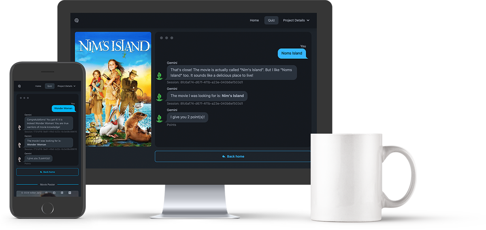
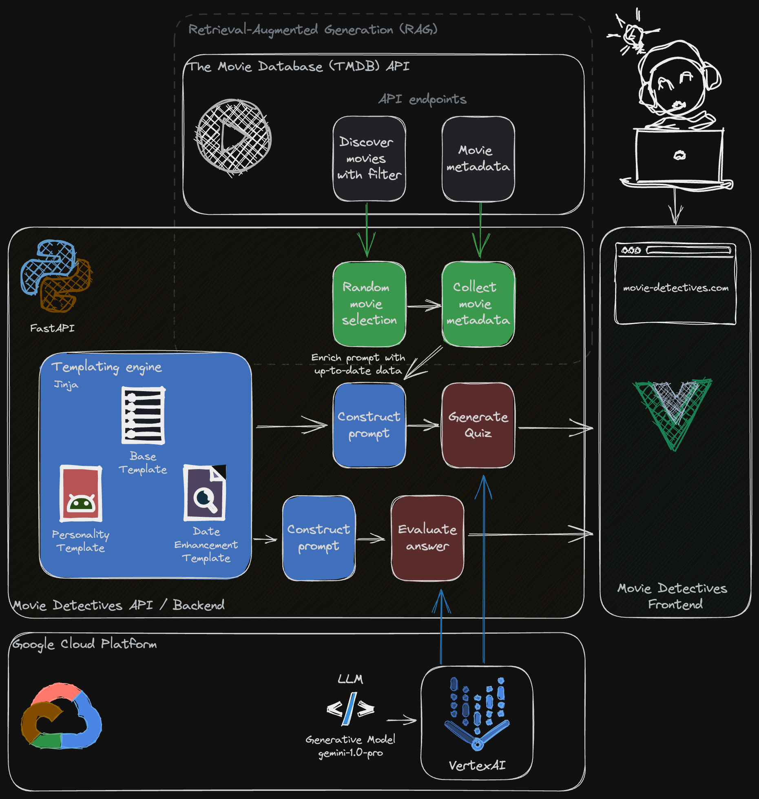
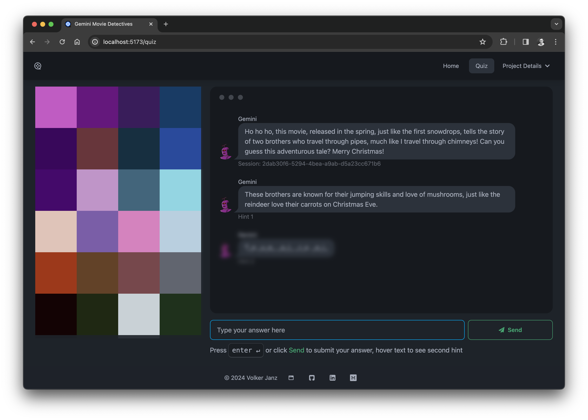

# Gemini Movie Detectives API

**This project was created as part of the [Google AI Hackathon 2024](https://googleai.devpost.com/)**.


Gemini Movie Detectives is a project aimed at leveraging the power of the Gemini 1.0 Pro model via VertexAI to
create an engaging quiz game using the latest movie data from The Movie Database (TMDB).

Try it yourself: [movie-detectives.com](https://movie-detectives.com/)

## Backend

The backend infrastructure is built with FastAPI and Python, employing the Retrieval-Augmented Generation (RAG)
methodology to enrich queries with real-time metadata. Utilizing Jinja templating, the backend modularizes
prompt generation into base, personality, and data enhancement templates, enabling the generation of accurate
and engaging quiz questions.

## Frontend

The frontend is powered by Vue 3 and Vite, supported by daisyUI and Tailwind CSS for efficient frontend
development. Together, these tools provide users with a sleek and modern interface for seamless interaction
with the backend.

## Summary

In Movie Detectives, quiz answers are interpreted by the Language Model (LLM) once again, allowing for dynamic
scoring and personalized responses. This showcases the potential of integrating LLM with RAG in game design and
development, paving the way for truly individualized gaming experiences. Furthermore, it demonstrates the
potential for creating engaging quiz trivia or educational games by involving LLM. Adding and changing personalities
or languages is as easy as adding more Jinja template modules. With very little effort, this can change the
full game experience, reducing the effort for developers. Try it yourself and change the AI personality
in the quiz configuration.



Frontend: [gemini-movie-detectives-ui](https://github.com/vojay-dev/gemini-movie-detectives-ui)

- [Project overview](#project-overview)
- [Project setup](#project-setup)
- [Configuration](#configuration)
- [Docker](#docker)
  - [Build](#build)
  - [Run](#run)
  - [Save image for deployment](#save-image-for-deployment)
- [API Example Usage](#api-example-usage)
  - [Get a list of movies](#get-a-list-of-movies)
  - [Get a customized list of movies](#get-a-customized-list-of-movies)
  - [Get a random movie with more details](#get-a-random-movie-with-more-details)
  - [Start a quiz](#start-a-quiz)
  - [Send answer and finish a quiz](#send-answer-and-finish-a-quiz)
- [Rate Limit](#rate-limit)
- [Personalities](#personalities)
  - [Example Usage: Santa Claus Personality](#example-usage-santa-claus-personality)
- [Languages](#languages)
  - [Example Usage: German Language](#example-usage-german-language)

## Project overview

- Python 3.12 + FastAPI
- Poetry for dependency management
- Docker for deployment
- TMDB API for movie data
- VertexAI and Gemini for generating movie quizzes


*Movie Detectives - System Overview*

## Project setup

**(Optional) Configure poetry to use in-project virtualenvs**:
```sh
poetry config virtualenvs.in-project true
```

**Install dependencies**:
```sh
poetry install
```

**Run**:
```sh
source .venv/bin/activate
uvicorn gemini_movie_detectives_api.main:app --reload
curl -s localhost:8000/movies | jq .
```

## Configuration

The API is configured via environment variables. If a `.env` file is present in the project root, it will be loaded
automatically. The following variables must be set:

- `TMDB_API_KEY`: The API key for The Movie Database (TMDB).
- `GCP_PROJECT_ID`: The ID of the Google Cloud Platform (GCP) project used for VertexAI and Gemini.
- `GCP_LOCATION`: The location used for prediction processes.
- `GCP_SERVICE_ACCOUNT_FILE`: The path to the service account file used for authentication with GCP.

There are more config variables with defaults, which can be used to adjust the default API behavior.

## Docker

### Build

```sh
docker image rm gemini-movie-detectives-api
docker build -t gemini-movie-detectives-api .
```

### Run

```sh
docker run -d --rm --name gemini-movie-detectives-api -p 9091:9091 gemini-movie-detectives-api
curl -s localhost:9091/movies | jq .
docker stop gemini-movie-detectives-api
```

### Save image for deployment

```sh
docker save gemini-movie-detectives-api:latest | gzip > gemini-movie-detectives-api_latest.tar.gz
```

## API Example Usage

### Get a list of movies

```sh
curl -s localhost:8000/movies | jq .
```

### Get a customized list of movies

```sh
curl -s "localhost:8000/movies?page=3&vote-avg-min=8&vote-count-min=1000" | jq ".[0]"
```

```json
{
  "adult": false,
  "backdrop_path": "/eHMh7kChaNeD4VTdMCXLJbRTzcI.jpg",
  "genre_ids": [
    18,
    36,
    10752
  ],
  "id": 753342,
  "original_language": "en",
  "original_title": "Napoleon",
  "overview": "An epic that details the checkered rise and fall of French Emperor Napoleon Bonaparte and his relentless journey to power through the prism of his addictive, volatile relationship with his wife, Josephine.",
  "popularity": 193.344,
  "poster_path": "/vcZWJGvB5xydWuUO1vaTLI82tGi.jpg",
  "release_date": "2023-11-22",
  "title": "Napoleon",
  "video": false,
  "vote_average": 6.484,
  "vote_count": 1953,
  "poster_url": "https://image.tmdb.org/t/p/original/vcZWJGvB5xydWuUO1vaTLI82tGi.jpg"
}
```

## Get a random movie with more details

```sh
curl -s localhost:8000/movies/random | jq .
```

```json
{
  "adult": false,
  "backdrop_path": "/oe7mWkvYhK4PLRNAVSvonzyUXNy.jpg",
  "belongs_to_collection": null,
  "budget": 85000000,
  "genres": [
    {
      "id": 28,
      "name": "Action"
    },
    {
      "id": 53,
      "name": "Thriller"
    }
  ],
  "homepage": "https://www.amazon.com/gp/video/detail/B0CH5YQPZQ",
  "id": 359410,
  "imdb_id": "tt3359350",
  "original_language": "en",
  "original_title": "Road House",
  "overview": "Ex-UFC fighter Dalton takes a job as a bouncer at a Florida Keys roadhouse, only to discover that this paradise is not all it seems.",
  "popularity": 1880.547,
  "poster_path": "/bXi6IQiQDHD00JFio5ZSZOeRSBh.jpg",
  "production_companies": [
    {
      "id": 21,
      "logo_path": "/usUnaYV6hQnlVAXP6r4HwrlLFPG.png",
      "name": "Metro-Goldwyn-Mayer",
      "origin_country": "US"
    },
    {
      "id": 1885,
      "logo_path": "/xlvoOZr4s1PygosrwZyolIFe5xs.png",
      "name": "Silver Pictures",
      "origin_country": "US"
    }
  ],
  "production_countries": [
    {
      "iso_3166_1": "US",
      "name": "United States of America"
    }
  ],
  "release_date": "2024-03-08",
  "revenue": 0,
  "runtime": 121,
  "spoken_languages": [
    {
      "english_name": "English",
      "iso_639_1": "en",
      "name": "English"
    }
  ],
  "status": "Released",
  "tagline": "Take it outside.",
  "title": "Road House",
  "video": false,
  "vote_average": 7.14,
  "vote_count": 1182,
  "poster_url": "https://image.tmdb.org/t/p/original/bXi6IQiQDHD00JFio5ZSZOeRSBh.jpg"
}
```

### Start a quiz

```sh
curl -s -X POST localhost:8000/quiz \
  -H 'Content-Type: application/json' \
  -d '{"vote_avg_min": 5.0, "vote_count_min": 1000.0, "popularity": 3}' | jq .
```

```json
{
  "quiz_id": "84c19425-c179-4198-9773-a8a1b71c9605",
  "question": {
    "question": "Imagine a family road trip, but not just any road trip, a life-or-death race against time! A giant space rock is hurtling towards Earth, and this family is trying to outrun the end of the world. Along the way, they witness cities crumbling like sandcastles and meet people who are both kind and cruel. Can they make it to safety in time?",
    "hint1": "The movie is all about a family trying to survive a global catastrophe.",
    "hint2": "Gr_e_l_nd"
  },
  "movie": {...}
}
```

### Send answer and finish a quiz

```sh
curl -s -X POST localhost:8000/quiz/84c19425-c179-4198-9773-a8a1b71c9605/answer \
  -H 'Content-Type: application/json' \
  -d '{"answer": "Greenland"}' | jq .
```

```json
{
  "quiz_id": "84c19425-c179-4198-9773-a8a1b71c9605",
  "question": {...},
  "movie": {...},
  "user_answer": "Greenland",
  "result": {
    "points": "3",
    "answer": "Congratulations! You got it! Greenland is the movie we were looking for. You're like a human GPS, always finding the right way!"
  }
}
```

## Rate Limit

In order to control costs and prevent abuse, the API offers a way to limit the number of quiz sessions per day.

There is a default value which can be overwritten by using an environment variable called `QUIZ_RATE_LIMIT`. It is reset
every day at midnight. The API also has an endpoint to fetch details about the limit and current usage:

```sh
curl -s localhost:8000/limit | jq .
```

```json
{
  "daily_limit": 100,
  "quiz_count": 0,
  "last_reset_time": "2024-04-06T12:39:29.857703",
  "last_reset_date": "2024-04-06",
  "current_date": "2024-04-06"
}
```

Once a quiz is started and `current_date` is greater than `last_reset_date`, the `quiz_count` is reset to 0.

# Personalities

Due to the modularity of the prompt generation, it is possible to easily switch personalities of the quiz master. The
personalities are defined in Jinja templates in the `gemini_movie_detectives_api/templates/personality/` directory.
They are managed by a `StrEnum` in `gemini_movie_detectives_api/prompt.py`, which makes it easy to extend.

## Example Usage: Santa Claus Personality



The following example shows how to switch to the Santa Claus / Christmas personality for a quiz:

```sh
curl -s -X POST localhost:8000/quiz \
  -H 'Content-Type: application/json' \
  -d '{"vote_avg_min": 5.0, "vote_count_min": 1000.0, "popularity": 3, "personality": "christmas"}' | jq .
```

```json
{
  "quiz_id": "e1d298c3-fcb0-4ebe-8836-a22a51f87dc6",
  "question": {
    "question": "Ho ho ho, this movie takes place in a world of dreams, just like the dreams children have on Christmas Eve after seeing Santa Claus! It's about a team who enters people's dreams to steal their secrets. Can you guess the movie? Merry Christmas!",
    "hint1": "The main character is like a skilled elf, sneaking into people's minds instead of houses. ",
    "hint2": "I_c_p_i_n "
  },
  "movie": {...}
}
```

# Languages

Due to the modularity of the prompt generation, it is also possible to easily switch the language of the game.
Languages are defined in Jinja templates in the `gemini_movie_detectives_api/templates/language/` directory.
They are managed by a `StrEnum` in `gemini_movie_detectives_api/prompt.py`, which makes it easy to extend.

## Example Usage: German Language

The following example shows how to switch to the Santa Claus / Christmas personality for a quiz:

```sh
curl -s -X POST localhost:8000/quiz \
  -H 'Content-Type: application/json' \
  -d '{"vote_avg_min": 5.0, "vote_count_min": 1000.0, "popularity": 3, "language": "german"}' | jq .
```

```json
{
  "quiz_id": "7f5f8cf5-4ded-42d3-a6f0-976e4f096c0e",
  "question": {
    "question": "Stellt euch vor, es gäbe riesige Monster, die auf der Erde herumtrampeln, als wäre es ein Spielplatz! Einer ist ein echtes Urviech, eine Art wandelnde Riesenechse mit einem Atem, der so heiß ist, dass er euer Toastbrot in Sekundenschnelle rösten könnte. Der andere ist ein gigantischer Affe, der so stark ist, dass er Bäume ausreißt wie Gänseblümchen. Und jetzt ratet mal, was passiert? Die beiden geraten aneinander, wie zwei Kinder, die sich um das letzte Stück Kuchen streiten! Wer wird wohl gewinnen, die Riesenechse oder der Superaffe? Das ist die Frage, die sich die ganze Welt stellt! ",
    "hint1": "Der Film spielt in einer Zeit, in der Monster auf der Erde wandeln.",
    "hint2": "G_dz_ll_ vs. K_ng "
  },
  "movie": {...}
}
```
